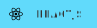
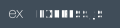
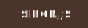

<h2 align="center">Gabriel Donnantuoni Lima</h2>
<h3 align="center">Web Software Develeper Student | Trybe</h3>

-----

## About me

I'm a civil engineer that changed career to software engineering. In 2021 I did this transition with <a href="https://www.betrybe.com">Trybe</a> help, it was a great experience that made me grow as a person and as a professional. One of the things I like the most is a good challenge and today I'm working at <a href="https://jungledevs.com/">Jungle Devs</a>, a great place to work, full of great people and with a inspiring, challenging and healthy environment.

My goal in life is to become an expert problem solver in my area, an inspiring dad and an excelent friend to all people that I love.

-----

## Social Media

  
  
  

## Technologies

Technologies and tools I'm using and learning:

#### Core
  <!--  -->

  
  
  
  
  
  
  
  
  
  

#### Front-end

  
  
  
  
  

#### Back-end

  
  
  
  
  
  

#### Testing

  
  
  
  
  
  

<!--
v1.6
**gabrielDonnantuoni/gabrielDonnantuoni** is a ✨ _special_ ✨ repository because its `README.md` (this file) appears on your GitHub profile.

EXAMPLE OF BADGE SOURCE => https://img.shields.io/badge/pytest-0A9EDC?style=for-the-badge&logo=pytest&logoColor=white
ICONS PROPER COLOR SOURCE => https://simpleicons.org/

Here are some ideas to get you started:

- 🔭 I’m currently working on ...
- 🌱 I’m currently learning ...
- 👯 I’m looking to collaborate on ...
- 🤔 I’m looking for help with ...
- 💬 Ask me about ...
- 📫 How to reach me: ...
- 😄 Pronouns: ...
- ⚡ Fun fact: ...
-->
